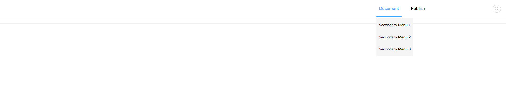

# UI.css - Packed Framework For Pure HTML/CSS/JS Front-End Developer

## Content

- [Usage](#usage)
- [Components](#components)
    - [Button](#button)
        - [Default Button](#default-button)
        - [Normal Button](#normal-button)
        - [Danger Button](#danger-button)
        - [Disabled Button](#disabled-button)
        - [Dashed Button](#dashed-button)
    - [Menu](#menu)
      - [item](#item)
    - [Card](#card)
    - [Layout](#layout)
        - [Head](#layouthead)
- [Functions](#functions)
    - [uprompt](#uprompt)

## Usage
> download the latest release, add all the files in './dist' folder to your project folder, then add : 

> `<link rel="stylesheet" href="PATH\\TO\\main.css">`

> to the HTML file you want to build.

---

## Components

### **Button**
There are 5 kinds of button defined in the UI.css Framework(1.0.0),
 each of them has its own unique style. You should use different type of button in different occasion.

#### Default Button

The first kind is 'Default'. It is just called default, it doesn't means that you don't need to define what kind of 
button it is in the classList. To add a 'Default button' to your HTML file, add:
`<button class="default">Whatever name you want</button>`
to your HTML code.

#### Normal Button

The second kind is 'Normal'. You can also call it 'Primary' type, it is more attractive for users, so you should use it 
as primary button in your website. To add a 'Normal button' to your HTML file, add: `<button class="normal">Whatever 
name you want</button>`
to your HTML code.

#### Danger Button

The third kind is 'Danger'. If you want to convey a danger information to user, please use this button. Examples 
contains Delete Button/ Clear Button and soooo on. Whatever it will be, you know what I mean. To add a 'Danger button' 
to your HTML file, add: `<button class="danger">Whatever name you want</button>`
to your HTML code.

#### Disabled Button

The forth kind is 'Disabled', before you set some buttons as 'disabled', please remove other classNames in the list, or 
it will display incorrectly.
To add a 'Disabled' Button, add: `<button class="disabled">Whatever name you want</button>` to your HTML code.

#### Dashed Button

The fifth kind is 'Dashed', the only difference between this and default button is dashed button has a dashed border, 
it's less attractive than default button. To add a 'Dashed' Button, add: `<button class="dashed">Whatever name you want
</button>` to your HTML code.

---

### **Menu**

This component is here to build your site's menu.

Example:

``
  ``

`<a class="item" id="document">Document</a>`

`<a class="item" id="publish">Publish</a>`

`
`

Preview:

#### Secondary Menu

This component allows you to set secondary menu binding to the first one.

**Warning**: To make secondary menu works properly, the parent element must be a 'div'.

Example:

``
  ``

`
`

`Document`

``

`<a>Secondary Menu1</a>`

`<a>Secondary Menu2</a>`

`<a>Secondary Menu3</a>`

``

`</a>`

`<a class="item" id="publish">Publish</a>`

`
`

Preview:

---

### **Card**

This component is designed for you to display information to the user.

### **Layout**

This component is here to help you build your site's structure.

Example `<Layout></Layout>`

#### class [HCF]

The HCF class provides a template with a header/content/footer. It is well designed for you to show almost everything to user.

Example: `<Layout class="HCF"></Layout>`

---
## Functions

- ### **uprompt**

**usage**: use uprompt to display a message to user. To make it works, please add an element `<Messages id="Messages">
</Messages>` to your HTML file.

**parameters**:(Type:number, message:string, lastTime:number)

- Type: Defines what kind of message you want to show. There are 4 kinds of type, 1 refers to success;
2 refers to info; 3 refers to warning; 4 refers to error.

**example**: `uprompt(1,'Hello ui.css!',3)`